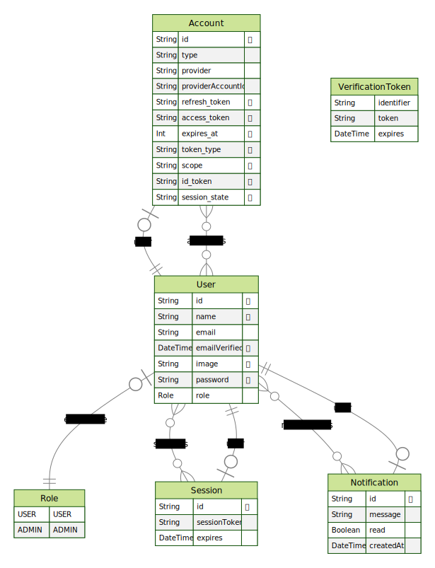

# DDD in NextJS backend

This is an example of how to approach to a DDD like architecture in a NextJS project. This is very much opinionated and it's not meant to be a guide, but rather a way to explore how to structure a project like this.

Key points:

- Event Based Architecture using an in-memory synchronous event bus
- Prevent imports from DDD folder that are not the entry point src/DDD/index.ts. This is done by eslint `import/no-internal-modules`` rule

In Domain-Driven Design, these domains represent different areas of the software's business logic. Each domain is isolated and can be developed independently, which helps in managing complexity and improving maintainability.

## Domain-Driven Design (DDD) Folder Structure

The DDD folder structure in this project is organized as follows:

- `DDD/`
  - `Email/`
  - `Notifications/`
  - `Shared/`
  - `User/`

Each subfolder within the `DDD/` directory represents a different domain of the application.

### Email

The `Email/` domain is responsible for handling all operations related to emails. It includes services for sending emails (`EmailService.ts`) and use cases such as sending a welcome email (`SendWelcomeEmail.ts`).

### Notifications

The `Notifications/` domain handles all operations related to notifications. It includes services for managing notifications (`NotificationService.ts`) and use cases such as sending a welcome notification (`SendWelcomeNotification.ts`).

### Shared

The `Shared/` domain contains shared resources that can be used across different domains. This includes the `EventBus.ts` for managing domain events and `PrismaService.ts` for interacting with the database.

### User

The `User/` domain is responsible for all operations related to users. It includes services for managing users (`UserService.ts`) and use cases such as registering a user (`UserRegister.ts`) and fetching user data with notifications (`UserDataWithNotifications.ts`).

## EventBus System

The EventBus system is a part of the `Shared/` domain and is a key component in our Domain-Driven Design architecture. It is implemented in the `EventBus.ts` file.

The EventBus system is responsible for managing domain events across the application. It allows different parts of the application to communicate with each other in a decoupled manner. This means that one part of the application can emit an event, and any other part of the application can listen for that event and react accordingly, without the two parts needing to know about each other.

Here's a basic example of how the EventBus system can be used:

```typescript
// Define a domain event
class UserRegistered implements DomainEvent {
  constructor(public readonly user: User) {}
}

// Subscribe to the event
EventBus.subscribe(UserRegistered, (event) => {
  console.log(`User registered: ${event.user.name}`);
});

// Publish the event
const user = new User(/* ... */);
EventBus.publish(new UserRegistered(user));
```

## DB schema:

Thanks to `prisma-erd-generator` this is autogenerated and placed in [docs/DB_schema.svg](./docs/DB_schema.svg).

Here is a preview:


```
